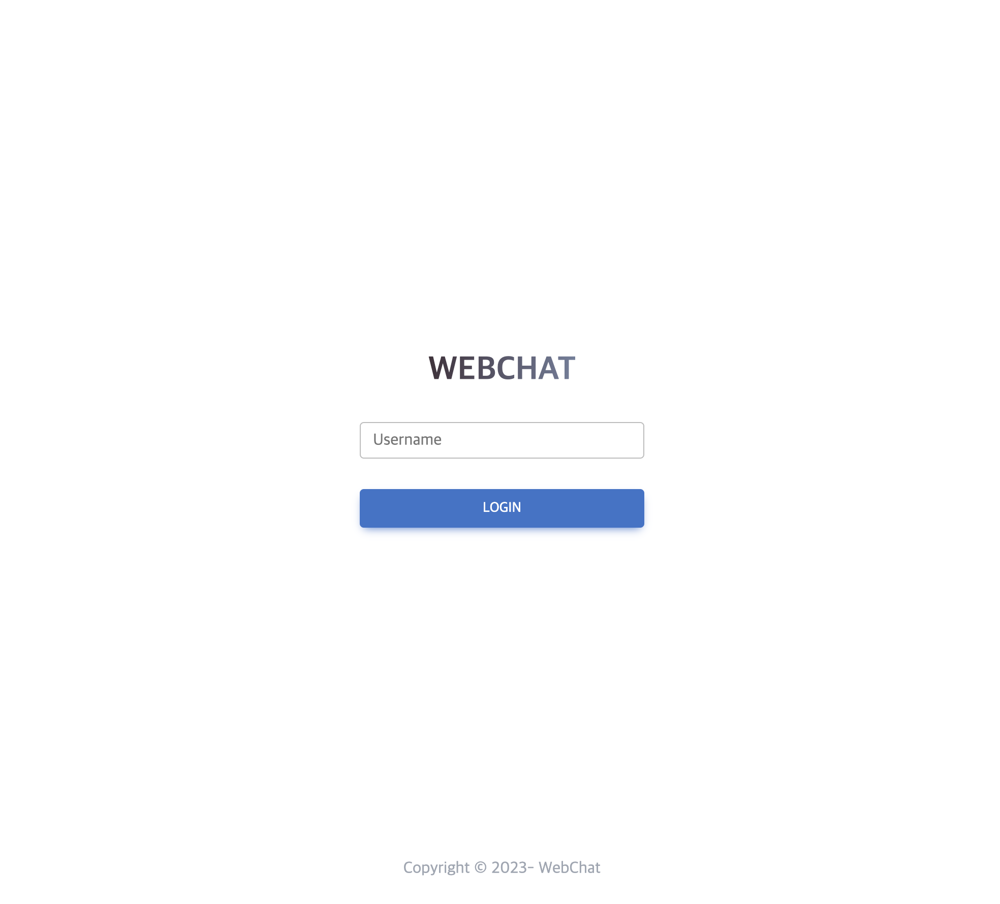

## WEBCHAT w/ KAFKA 


## 1. Introduction

```
KAFKA를 이용한 JAVA기반의 웹채팅 애플리케이션으로 다음 기능을 제공한다.
 - 다중 사용자가 채팅방에 접속하여 채팅을 주고 받을 수 있다.
 - 채팅 메세지는 KAFKA를 통해 전달되며, 채팅방에 접속한 사용자는 채팅 메세지를 실시간으로 수신할 수 있다.
 - 사용자는 채팅방을 생성/조회/삭제/수정할 수 있다. 
 - 사용자는 채팅방에 접속한 사용자 목록을 조회할 수 있다. 
 
 It is a JAVA-based web chat application using KAFKA and provides the following functions.
 - Multiple users can connect to the chat room and exchange chat messages.
 - Chat messages are transmitted through KAFKA, and users connected to the chat room can receive chat messages in real time.
 - Users can create / retrieve / delete / modify chat rooms.
 - Users can view the list of users connected to the chat room. 
 
```



This application uses the following tools:


>JAVA 11  
>SPRING BOOT 2.7.1  
>GRADLE 7.6  
>KAFKA 2.13-3.2.0  
>MongoDB 5.0.14  
>MDBootstrap 6.1.0  
>ThymeLeaf 3.0.15  
 

---

### 2. DONE

* 프로젝트 init
  - VCS 설정 (git)
* PROJECT WELCOME PAGE 설정
  - static resource > index.html
* css framework 선정 > MDBootstrap
* Template Engine 설정 > Thymeleaf
* CI/CD 설정 > GitHub action
  - deploy.yml, deploy.sh 작성 및 테스트 
* KAFKA 및 ZOOKEEPER 설치 및 CLI 실행 확인 
  - 서버 JAVA OPENJDK 11 설치 및 설정
  - zookeeper, kafka 설치 및 시스템데몬 등록
  - topic 생성 및 확인
  - cli producer, consumer 실행 및 확인
* JAVA-KAFKA 설정 및 연동 테스트
  - producer, consumer, topic API 작성 및 테스트
* 로그인 화면 UI 구현
  * UserName input form, toast message, validation, thymeleaf layout 설정
  * toastify, axios 라이브러리 추가
* DB
  - MongoDB svr 설치 및 설정
  - DB 연동 및 테스트
  - DB properties secret 처리
  - indexing
* chatRooms
  - chatRoom list layout: chat 목록 나열, chatRoom 생성 버튼 및 팝업
  - chatRooms 화면 기능 구현 : chatRooms 가져오기
    - chatRoom 생성
    - chatRoom 진입
  
---

### 3. TODO
 
* 챗-카프카 구현 시나리오 
  1. topic을 room으로 생성하고 user 진입시 해당 topic에 user를 동적 consumer로 추가하여 컨슈밍하게함
     - 동적 컨슈머 추가 테스트  (매우 복잡..ㅜ)
  2. topic은 하나로 하되 roomID를 key로 하여 메시지를 보내고, 해당 roomID를 가진 consumer만 메시지를 수신하게함 (심플해보임)

* client-server 구현 시나리오
  1. client는 서버에 websocket을 통해 접속
  2. websocket을 통해 서버에 메세지 전송 
  3. 서버는 메세지를 카프카로 프로듀스
  4. 서버에 listener를 통해 카프카로부터 메세지 수신
  5. 서버는 메세지를 클라이언트에게 소켓을 통해 전송
  
* chatRomm
  - chatRoom layout: chatRoom title, chatRoom 입장자 목록, chatRoom 채팅창, chatRoom 채팅 입력창, chatRoom 나가기 버튼, chat Message layout
  - chatRoom 기능 구현
    - chatRoom 입장
    - chatRoom 나가기
    - chatRoom 채팅 입력
    - chatRoom 채팅 메시지 수신
    - chatRoom 채팅 메시지 전송**

* chatRoom 삭제 로직
  - 방 접속 인원이 0명이면 삭제
  - 방 접속 인원은 어떻게 관리할까?
    - 웹브라우저를 나갈때 마다? : beforeunload  
    - 페이지 이동 시 마다? : unload
    - 웹소켓 연결을 끊을때 마다? 

* ApplicationContext - ApplicationEvent 검토 및 활용 범위 검토  
* websocket, STOMP 검토
* KAFKA TOPIC, PARTITION 검토 
  - room 단위는 어떻게 처리할까?


---

### 4. ERROR HANDLING

* error: invalid source release: 17
  - [PROJECT] build.gradle > sourceCompatibility = 11
* layout:decorate="~{layout/default_layout} 작동안함
  - [PROJECT] build.gradle > implementation 'nz.net.ultraq.thymeleaf:thymeleaf-layout-dialect' 추가
* js Keydown 이벤트 한글 중복 입력 현상 
  - https://kwangsunny.tistory.com/33 ; , 한글이나 중국어같이 영어가 아닌 글자들은 한 글자가 영어보다 많은 정보를 담고있기 때문에 키입력 순간부터 입력완료 까지 시간이 걸리고, 이는 keydown 이벤트가 이미 발생되고 난 후에도 진행중일 수 있다
  - 방안 keydown => keypress 로 변경
* 컨트롤러 두 번씩 호출 현상 
  - href="#" 으로 인한 문제
* thymeleaf : template might not exist ..... 
  - templates의 상대경로로 잡아줘야함  /layout/default_layout.html > layout/default_layout.html
  - https://jamong-icetea.tistory.com/190
  

---

### 5. REFERENCE & TIPS

* fire wall CMD: iptables -I INPUT 1 -p tcp --dport 8080 -j ACCEPT
* MDB : https://mdbootstrap.com/docs/standard/getting-started/installation/ 
* Bootstrap Doc : https://getbootstrap.kr/
* Chat UI : https://mdbootstrap.com/docs/standard/design-blocks/chat/
* MongoDb : https://www.infracody.com/2022/05/install-mongodb-on-centos-7.html
* Kafka Topic Naming Convention : https://data-engineer-tech.tistory.com/36
* mongodb conf path : /etc/mongod.conf
* Dynamic Kafka consumer : https://medium.com/bliblidotcom-techblog/dynamic-spring-boot-kafka-consumer-af8740f2c703 


